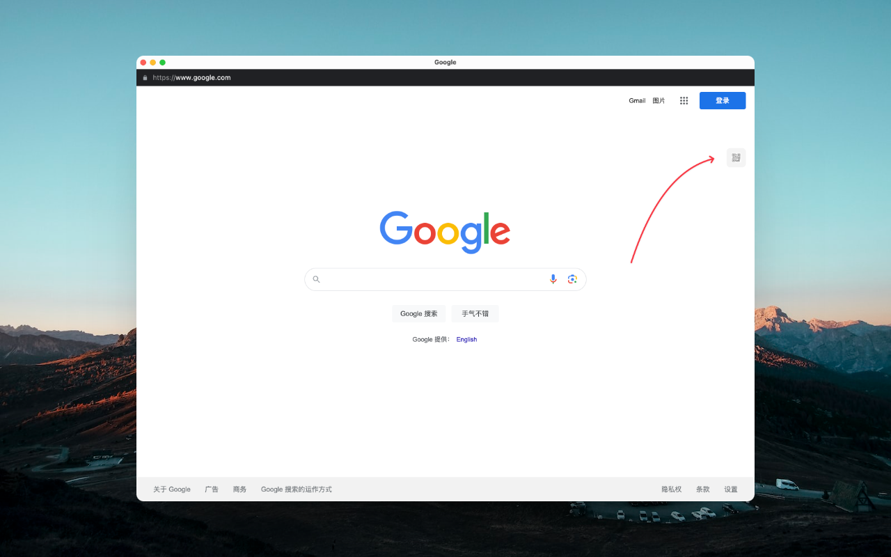
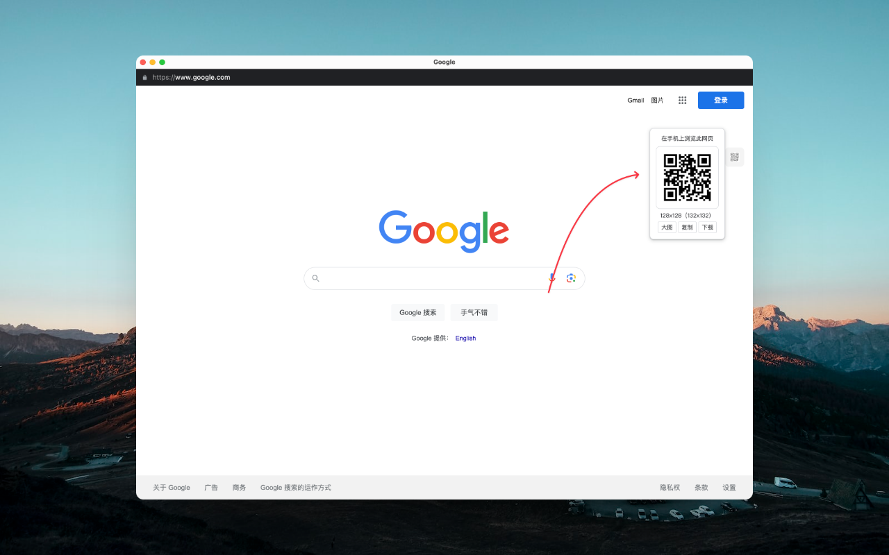
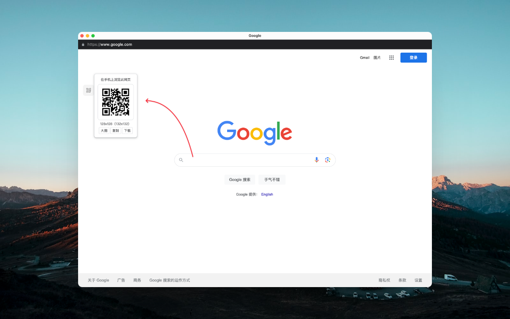
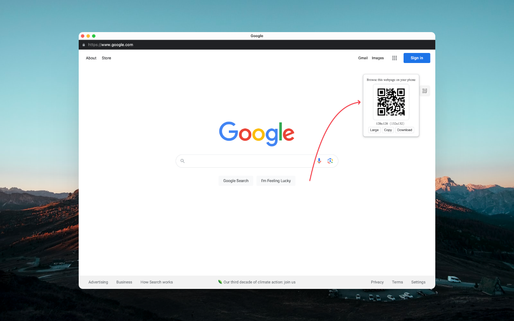
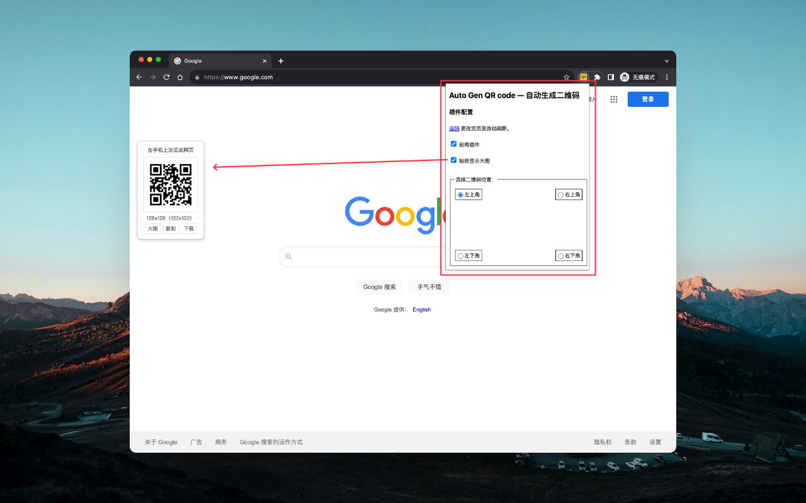
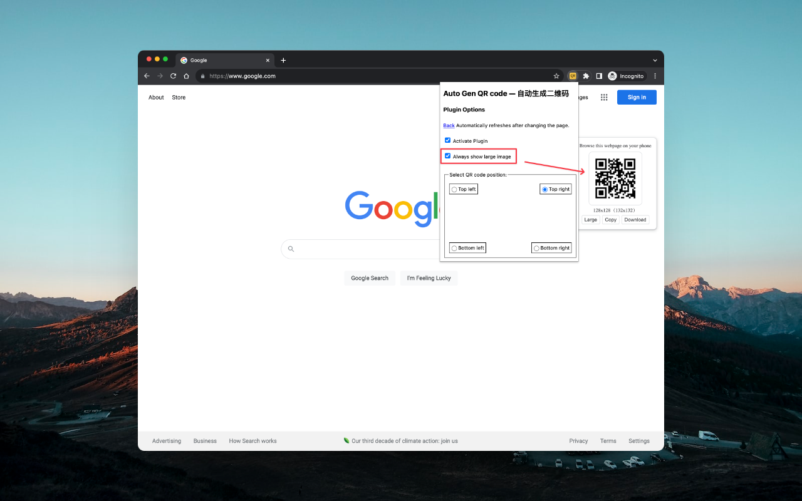
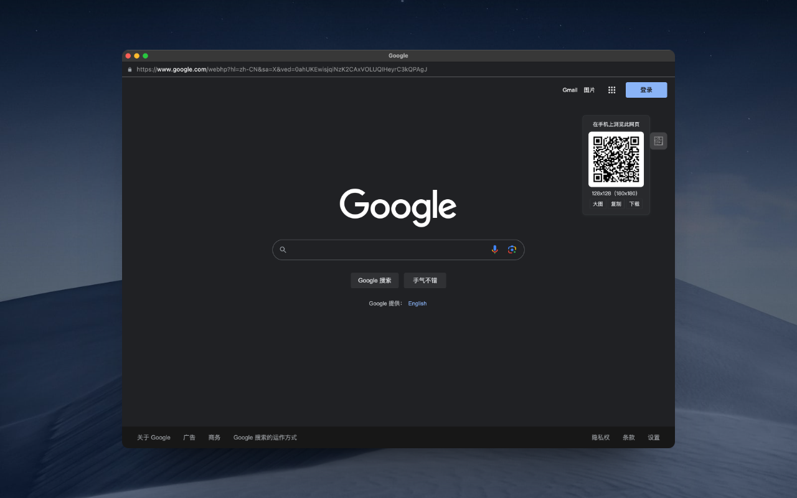

# Auto Gen QR code — 自动生成二维码

## 介绍

这是一个可以自动生成二维码的插件，可以自定义二维码的在页面的位置、启动/停止及点击复制二维码的功能。

## 功能列表

- [x] 启动/停止
- [x] 自定义二维码在页面的位置
- [x] 支持查看大图
- [x] 支持复制二维码
- [x] 支持下载二维码
- [x] 支持暗黑模式
- [ ] 二维码显示网站 favicon 图标

## 预览

## 感谢

- [QR Code generator library](https://www.nayuki.io/page/qr-code-generator-library)